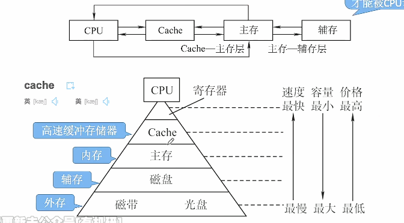
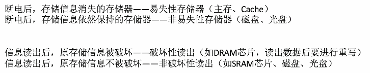
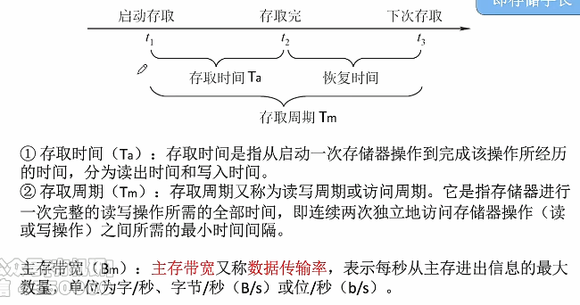

# 存储器的基本概念

1. ### 存储器的分类——层次：

   

   注意：

   - 辅存中的数据只有**调入主存之后才能够被CPU访问**，**CPU无法直接访问辅存**；

   - Cache用于解决CPU与主存**速度不匹配问题**；

   - **Cache——主存：**硬件自动完成；

   - **主存——辅存：**由硬件+操作系统完成，实现**虚拟存储系统**，**解决了主存容量不够的问题**。

      

2. ### 存储器的分类——存储介质：

   - **半导体存储器：**主存、Cache；

   - **磁表面存储器：**磁盘、磁带；

   - **光存储器：**光盘。

     

3. ### 存储器的分类——存取方式：

   - **随机存取存储器RAM：**读写任何一个存储单元所需时间都相同，与存储单元所在的物理位置无关；

   - **顺序存取存储器SAM：**读写一个存储单元所需的时间取决于存储单元所在的物理位置；

   - **直接存取的存储器DAM：**既有随机存取特性，也有顺序存取的特性。可以先直接选取信息所在的区域，然后按顺序方式存取。

   - **串行访问存储器（SAM与DAM）：**读写某个存储单元所需的时间与存储的那块的物理位置有关；

   - **相连存储器CAM（与RAM、SAM、DAM都不同）：**按照内容检索到存储位置进行读写（”快表“就是一种相联存储器）。

     

4. ### 存储器的分类——信息的可更改性：

   - **读写存储器：**即可读、也可写（如：磁盘、内存、Cache）；

   - **只读存储器：**只能读、不能写（如：音乐专辑、BIOS）；

   - **注意：**只读存储器并非不能进行写操作，不过比较困难。

     

5. ### 存储器的分类——信息的可保存性：

   

   

6. ### 存储器的性能指标：

   - **存储容量：**存储字数 * 字长

   - **单位成本：**每位价格 = 总成本 / 总容量（bit）

   - **存储速度：**数据传输率 = 数据的宽度 / 存储周期。

     