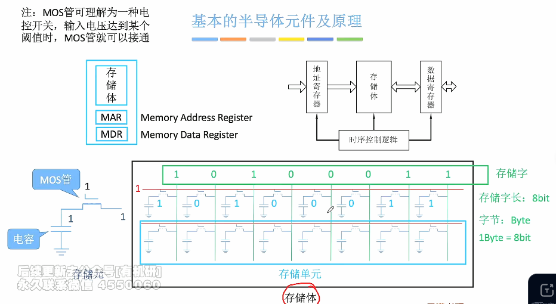
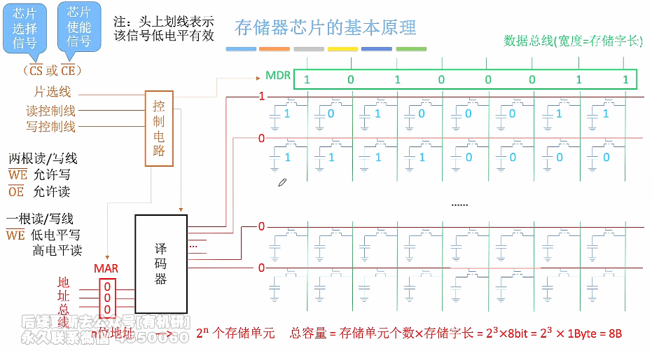
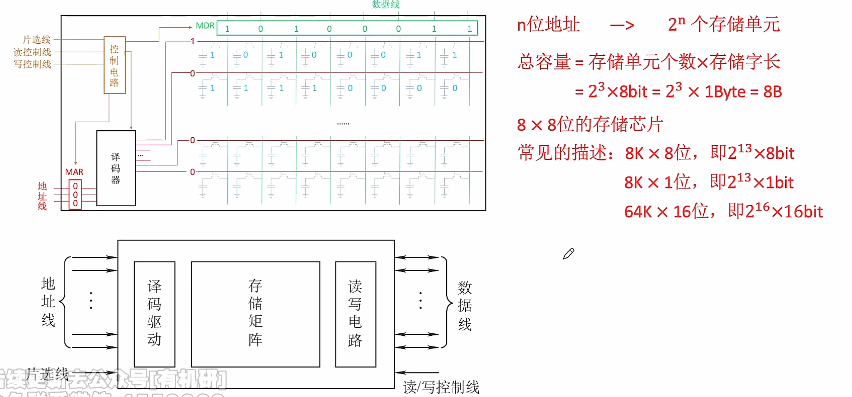
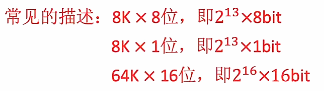
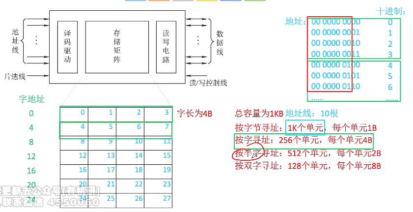

# 主存储器的基本组成

1. ### 基本的半导体元件及原理：

   

   

2. ### 存储芯片的基本原理：

    

   **注意：**

   - 根据题目提供的条件不同，读/写控制线**可能会出现一条或者两条**，这样的话芯片的引脚数量就会不一样；
   - 存储单元的个数就是MAR所能表达的位数，即2^n^。

   

3. ### 存储芯片的组合表示：

   

   **注意：**

   - **片选线的作用：**帮助译码器选择具体访问哪一个存储单元；

   - **常见考题：**给你几个数据，要求你判断存储芯片会对外**暴露多少个引脚（地址线、数据线、片选线、读写控制线）**；

   - 总容量 = 存储单元个数 * 存储字长

     **n * m位的存储芯片：**存储单元个数为n，存储字长为m。

     

     

4. ### 寻址：

   

**注意：**假如想要按字寻址，就是将编号进行算数左移，其他寻址方式都是类似。