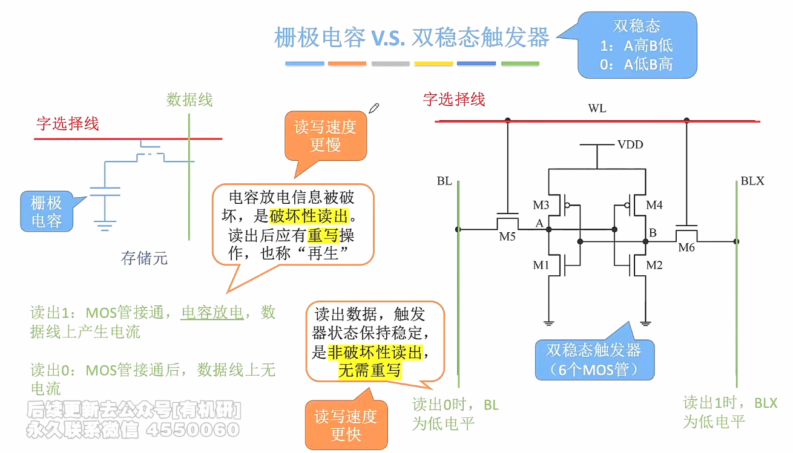

# DRAM和SRAM

**DRAM芯片：**使用栅极电容存储信息；

**SRAM芯片：**使用双稳态触发器存储信息。

1. ### 栅极电容 vs 双稳态触发器：

   

   **注：**

   - 栅极电容每个存储元制造成本更低，集成度高（因为体积较小），功耗低；

   - 双稳态触发器制造成本更高、集成度低、功耗大。

     

2. ### DRAM与SRAM的功能对比：

   

   **刷新的概念：**

   - 栅极电容中，电容里面的电荷只能保持2ms，即使不断电2ms后信息也会消失，因此需要2ms内”刷新“一次，即给电容充电；

   - 而双稳态触发器只要不断电，触发器的状态就不会改变；

   - DRAM的刷新由**存储器独立完成**，**不需要CPU的控制**；

   - 现在的主存通常采用SDRAM。

     

3. ### DRAM的刷新：

   - **多久刷新一次：**刷新周期一般为2ms；

   - **每次刷新多少个存储单元：**以行为单位，每次刷新一行的存储单元；

   - **为什么要使用行列地址：**假如有n位地址的数据线连接译码器，那么就需要**2^n^**根选通线，这在工程上实现十分复杂，而使用行列地址进行存储，那么选通线的数量就会减半，即**2^n/2^**根线，这就能更容易实现了。

     

   - **如何刷新：**有硬件支持，读出一行的信息之后重新写入，占用一个读 / 写周期；

   - **什么时刻刷新（经常考查这三种刷新策略）：**

     

     

4. ### DRAM的地址线复用技术：

   在原本的电路中，需要**n条**地址线来讲地址送到译码器的不同区域，而采用了**行列地址的存储策略**之后，只需要**n / 2条**地址线，并且可以先送到**行地址缓冲器**、再送到**列地址缓冲器**中，这样能使**地址线更少，芯片引脚更少**。

易错：在考虑DRAM的引脚数目时，需要考虑到DRAM采用了行列地址的存储策略，这样会导致地址引脚减半。