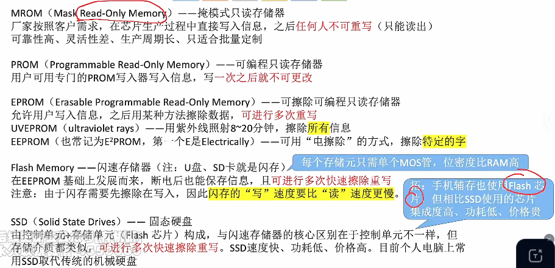

# 只读存储器ROM

1. ### 各种ROM的类别：

   

   

2. ### 计算机内重要的ROM：

   注意：

   - 主板上的BIOS芯片（ROM），存储了“自举装入程序：，引导装入操作系统（开机）；

   - **内存条 = 主存 = RAM + ROM**（单单一个RAM严格来说并不是完整的主存，还要加上一个ROM），并且RAM与ROM统一编址，ROM的地址接在RAM的地址之后。

     

3. ### 总结：

   - 虽然ROM芯片的名字是”只读“，但是很多ROM都可以实现”写“操作；
   - 闪存的写速度一般比读速度更慢，因为写入之前要先擦除；
   - RAM芯片是**易失性的**，ROM芯片有**非易失性**，很多ROM也有”随机存取“的特性。