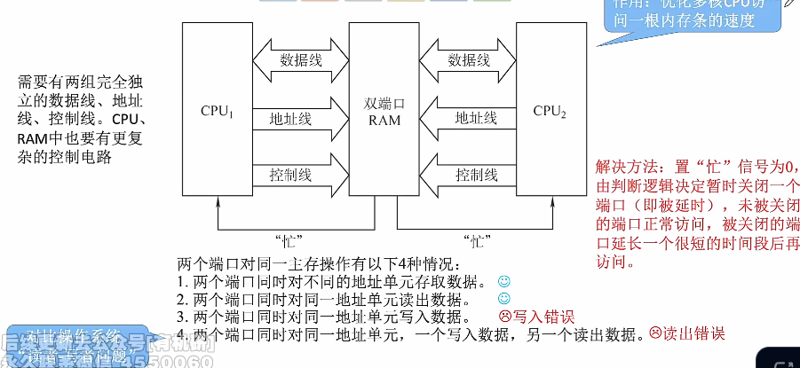
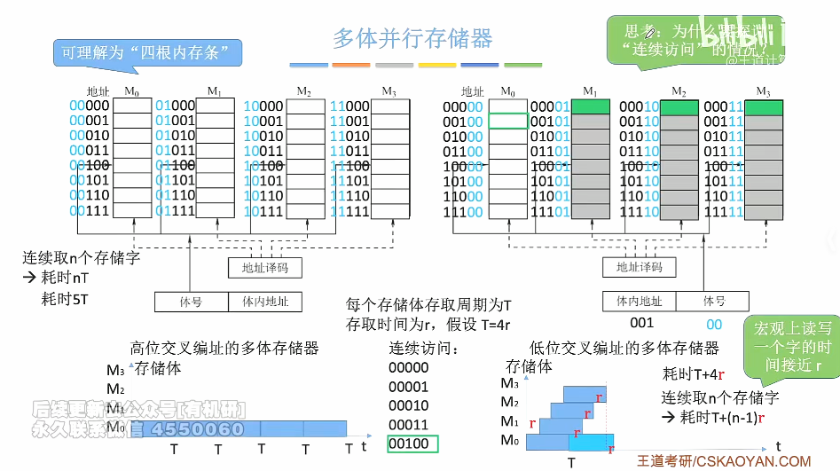
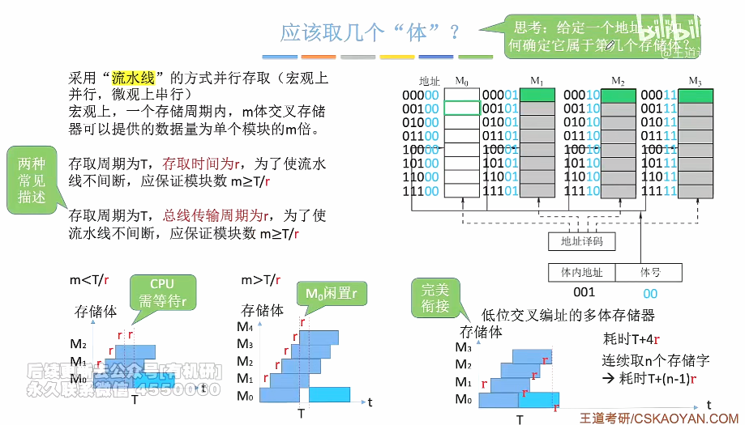
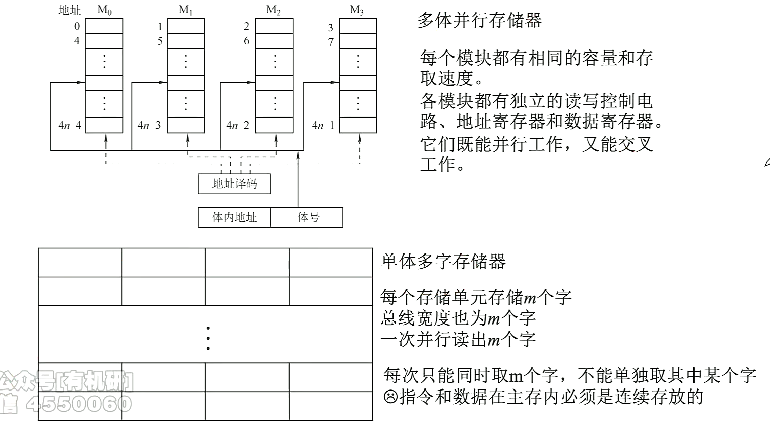

# 双端口RAM（408不会考）

​		用于优化多核CPU访问一根内存条的速度，支持两个CPU同时访问RAM。

# 多体并行存储器

1. ### 多体并行存储器的结构：

**注意：**

- **高位交叉编址的多体存储器：**每个存储体的**体号**存储在地址的**低位**，**高位**存储每个**存储体内部的地址**；
- **低位交叉编址的多体存储器（高频考点，重点掌握）：**每个存储体的**体号**存储在地址的**高位**，**低位**存储每个**存储体内部的地址**；
- 存取周期T = 存取时间r + 恢复时间

2. ### 应该取多少个存储体（考点）？

   

   **注意：**

   - m < T / r会导致CPU还需等待r的时间才能继续存取；

   - m > T / r会导致最初访问的存储体M~0~需要继续等待r的时间才能开始第二次存取；

   - 因此，m = T / r才是最优的数量。

     

3. ### 单体多字存储器：

   