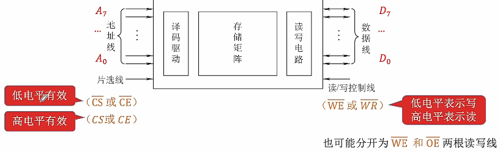
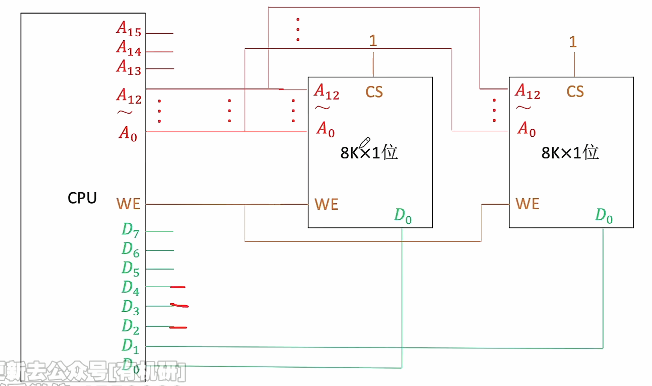
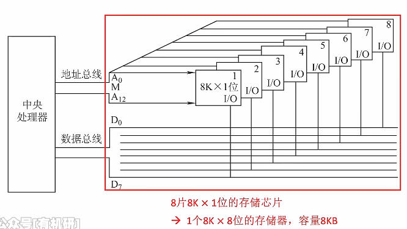
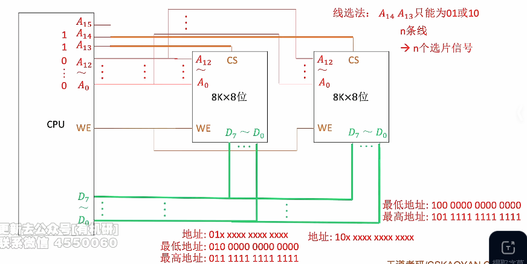
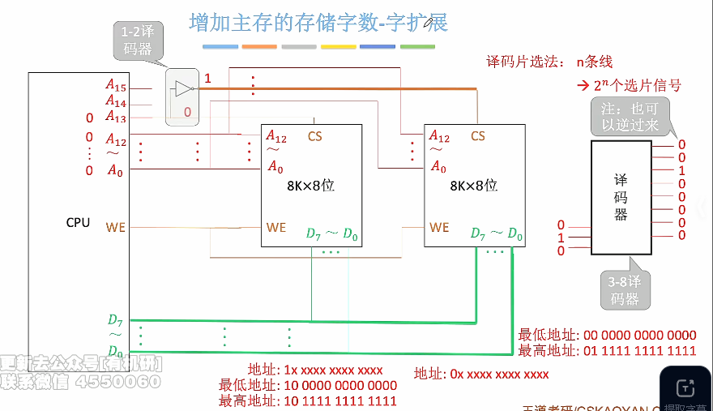
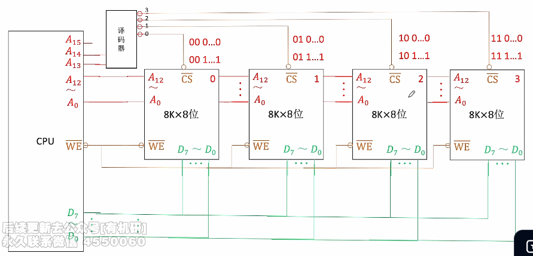
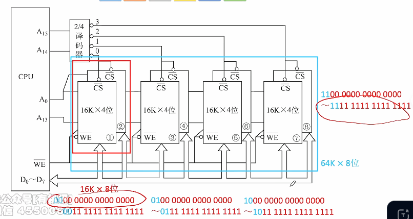
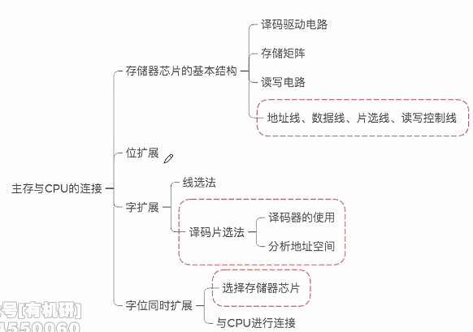
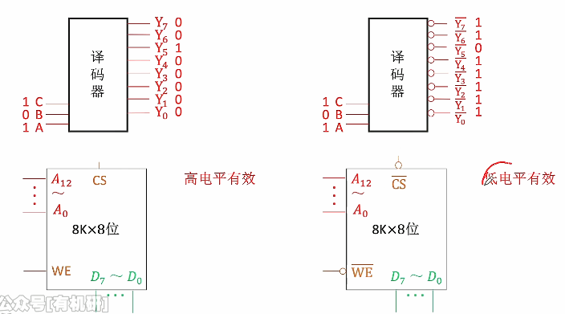
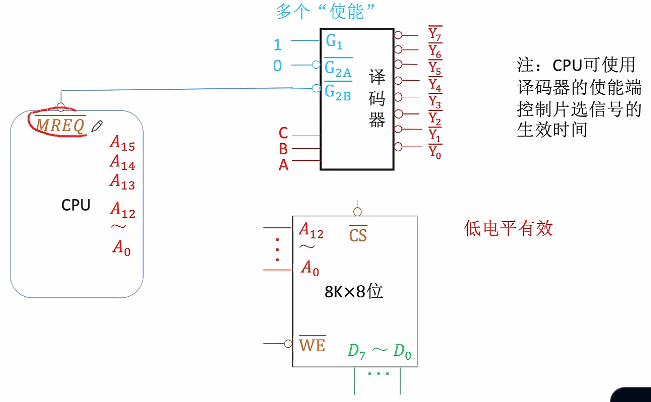

# 多块存储芯片和CPU的连接

1. ### 存储芯片的输入输出信号：

   

   

2. ### 增加主存的存储字长——位扩展：

   

   

   

3. ### 增加主存的存储字长——字扩展：

   - **线选法：**将不同存储单元的CS分别连接不同的地址单元。

   

   - **译码片选法：**

     由于使用线选法时，输入地址A~14~、A~13~只能为01或10，导致11和00无法使用，无法使用连续的一片地址空间，因此引入译码器更高效利用地址。

     

     

     **注意：**

     - n-m译码器：表示有n个输入地址，m个输出地址；
     - 考点：译码器接A~13~和A~15~两个接口，而不连接A14。

     

   - **两种片选法对照：**

     

4. ### 主存容量扩展——字位同时扩展：

   

   

5. ### 总结：

   

   

6. ### 译码器的使用区别：

   注意译码器的输出以及连接的CS（高电平和低电平）是相对应的，注意画图时高电平有效和低电平有效的区别。

   

   工作原理：

   - CPU先通过输入端送出地址信号，但是此时信号不太稳定；
   - 当地址信号稳定之后，MREQ地址信号稳定后发出存储器的请求信号；
   - 当使能端接收到MREQ发送的信号后，译码器开始工作，并向存储器输出CS信号。

   