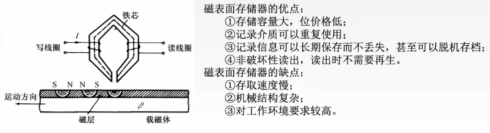
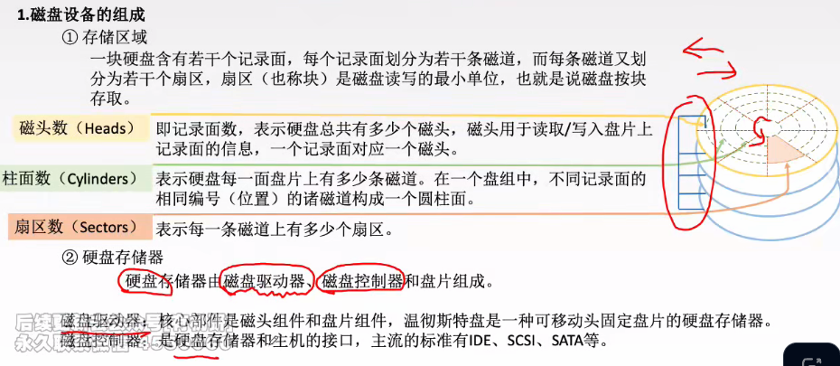
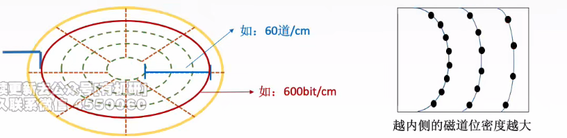
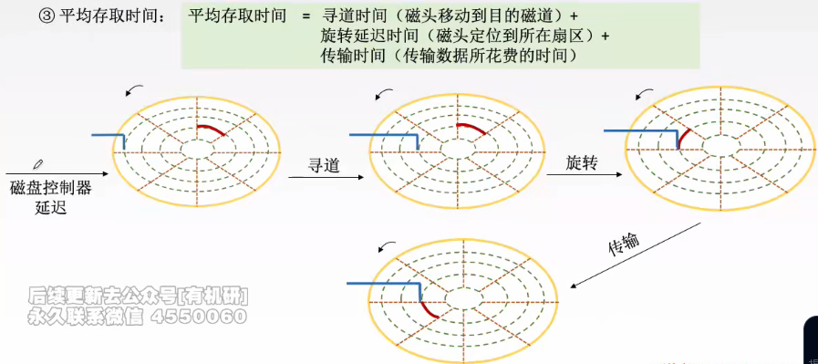
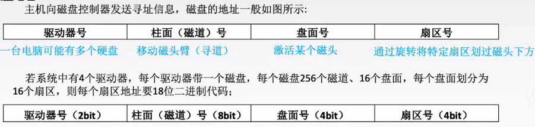
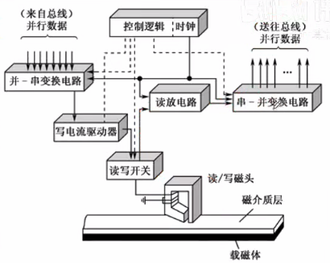
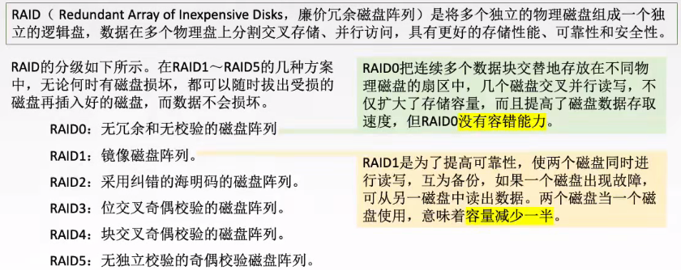
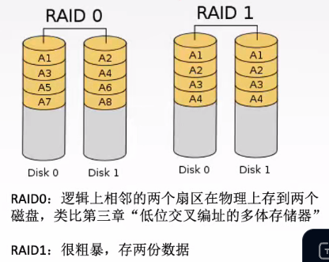
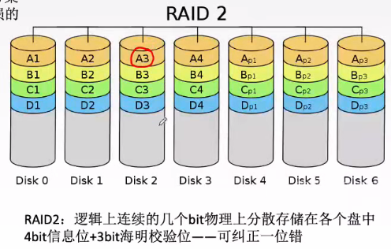

# 外存储器

1. ### 磁表面存储器的优缺点：

   磁表面存储器的读写操作都是1bit进行的。

   

   

2. ### 磁盘设备的组成：

   

   

3. ### 磁盘的性能指标：

   - **磁盘的容量：**一个磁盘所能存储的字节总数称为磁盘容量，磁盘容量有非格式化和格式化容量之分；

     **非格式化容量：**磁记录表面可以利用的磁化单元总数；

     **格式化容量：**按照某种特定的记录格式所能存储的信息的总量；

     **容量：**非格式化 > 格式化。

   - **记录密度：**记录密度是指盘片单位面积上记录的二进制的信息量，通常以道密度、位密度、面密度表示；

     **道密度（图中蓝色部分）：**沿磁盘半径方向单位长度上的磁道数；

     **位密度（图中红色部分）：**磁道单位长度上能记录的二进制代码位数；

     **面密度：**位密度 * 道密度。

     

     **注：**磁盘所有磁道记录的信息量**一定是相等**的，而并非园越大信息越多，因此每个磁道的位密度不同，**越靠近圆心的磁道位密度越大，最内侧的磁道的位密度很大程度上会影响磁盘的整体容量**。

     

     

   - **平均存取时间（考试常考）：**

     

     **注：**

     - 若题目没有给出旋转延迟时间，那么就按照**磁头转半圈**的时间进行计算;

     - 若题目给出了**磁盘控制器的延迟时间**，那么平均存取时间还要加上这部分时间。

       

   - **数据传输率：**磁盘存储器在单位时间内向主机传送数据的字节数。

     假设**磁盘转速为r（转/秒）**，每条**磁道容量为N个字节**，那么**传输速率为D~r~ = rN**。

     

4. ### 磁盘的地址结构：

   

   

5. ### 磁盘的工作过程：

   - 硬盘的主要操作是**寻址、读盘、写盘**。每个操作都对应一个控制字，当硬盘在工作时，**先读入控制字，再执行控制字**；

   - 由于硬盘是机械式部件，其**读写操作是串行**的，**不可能再同一个时刻既读又写**，**也不可能在同一时刻读取两组数据或写入两组数据**。

     

   - 由图可知：从总线中传入的数据原本是并行的，但是通过“并-串变换电路”可以将其转换为串行的供硬盘写入；当需要从硬盘中读取数据时，还需要通过“串-并变换电路”将串行数据转化为并行数据发送给总线。

     

6. ### 磁盘阵列RAID：

   

   - RAID通过**同时使用多个磁盘**，提高了**数据传输率**；
   - 通过在**多个磁盘上并行存取**来大幅提高存储系统的**数据吞吐量**；
   - 通过**镜像功能**，可以提高**安全可靠性**；
   - 通过**数据校验**，可以提供**容错能力**。

   

   

   - 对于磁盘阵列可以仅仅关注RAID0~2即可；
   - RAID0：条带化，提高存储速度，但是无容错能力；
   - RAID1：将镜像磁盘互为备份，但是比较浪费磁盘存储空间（浪费一半）；
   - RAID2~5：通过数据校验提高容错能力。