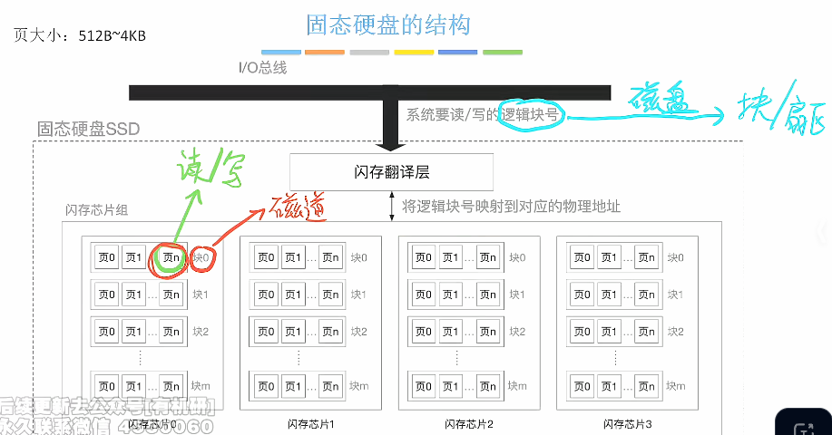
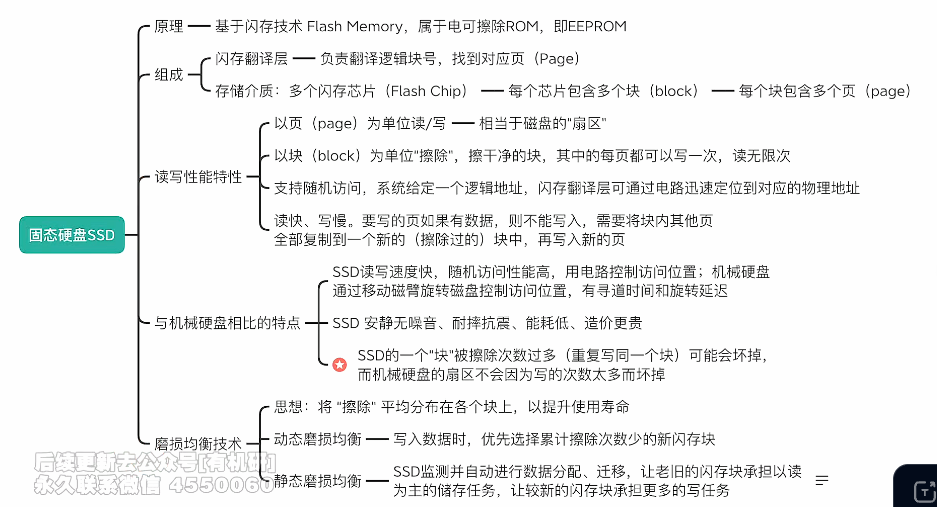

# 固态硬盘SSD

1. ### 固态硬盘的结构：

   

   **注（易混淆）：**

   - 固态硬盘是以页为一个读写单位的，因此SSD中系统要读/写的逻辑块号指的是一个页而不是块；

   - SSD中的页对应的是磁盘存储器中的扇区，而块对应的是磁盘中的一个磁道。

     

2. ### 总结（所有固态硬盘考点）：

   

   - **读写性能特性**、**与机械硬盘相比的特点**明确指定会在**操作系统中考察**。