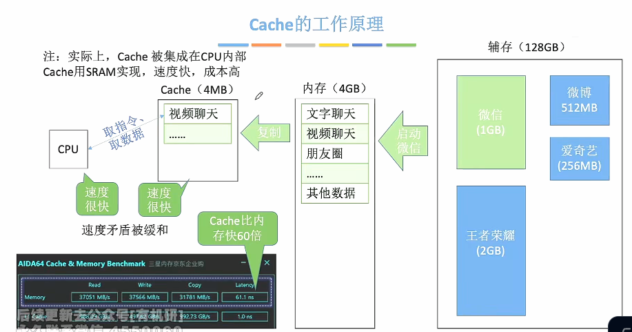
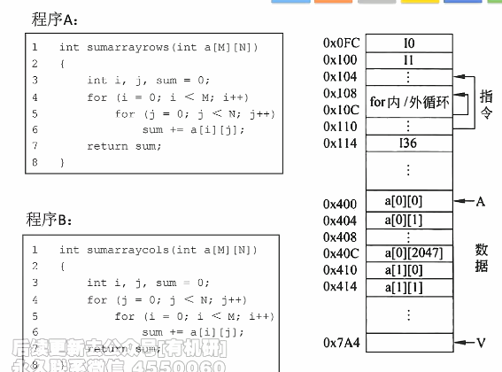
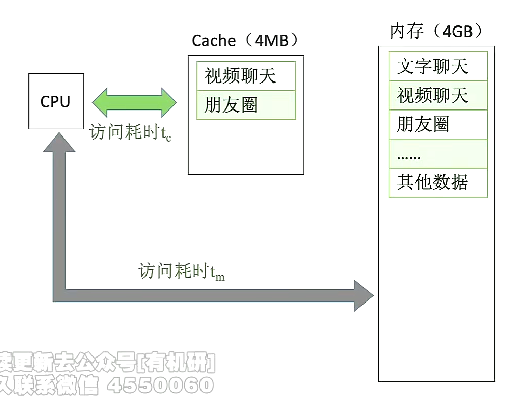
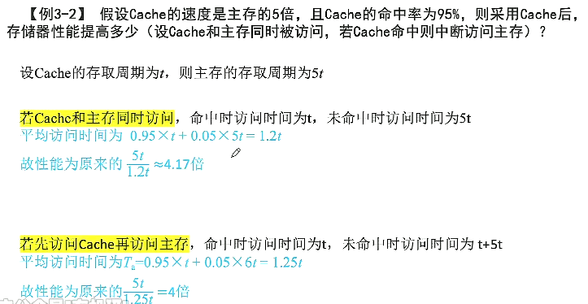
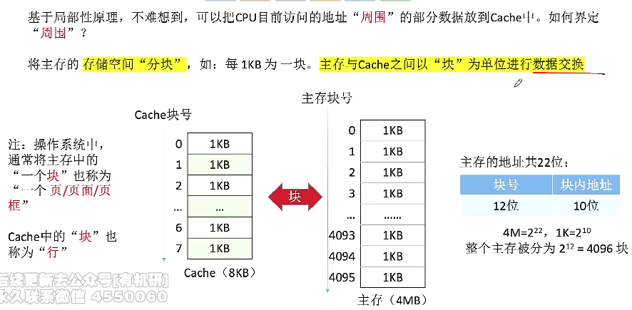

# 存储系统存在的问题

​		双端口RAM、多模块存储器提高存储器的工作速度，但是优化后还是与CPU差距很大，因此需要通过“Cache-主存”来改善存储体系。

# Cache

1. ### Cache的工作原理：

   

   

2. ### 局部性原理：

   - **空间局部性：**在最近的未来要用到的信息（指令或数据），很可能与现在正在使用的信息在存储空间上是邻近的（例如：顺序执行的指令代码、顺序访问数组元素）；

   - **时间局部性：**在最近的未来要用到的信息，很可能是现在正在使用的信息（例如：循环结构的指令代码）；

   - **对局部性原理的应用：**将CPU目前访问的地址”周围“的部分数据放到Cache中。

     

   - 由于程序A为逐行处理**（行优先）**，而程序B为逐列处理**（列优先）**，因此程序B在访问二维数组时，**空间局部性更差**。

     

3. ### 性能分析：

   

   - **t~c~：**访问一次Cache所需要的时间；

   - **t~m~：**访问一次主存所需要的时间；

   - **命中率H：**CPU欲访问的信息已经在Cache中的比率；

   - **缺失（未命中）率：**M = 1 - H；

   - **Cache—主存 系统的平均访问时间：**

     先访问Cache，若Cache未命中再访问主存：

   $$
   t = Ht_c + (1 - H)(t_c + t_m)
   $$

   ​		同时访问Cache和主存，若Cache命中则立即停止访问主存：
   $$
   t = Ht_c + (1 - H)t_m
   $$
   

   

4. Cache有待解决的问题：

   

   - 如何区分Cache与主存的数据块对应关系？——Cache和主存的映射方式
   - Cache很小，主存很大，如果Cache满了怎么办？——替换算法
   - CPU修改了Cache中的数据副本，如何确保主存中数据母本的一致性？——Cache写策略
