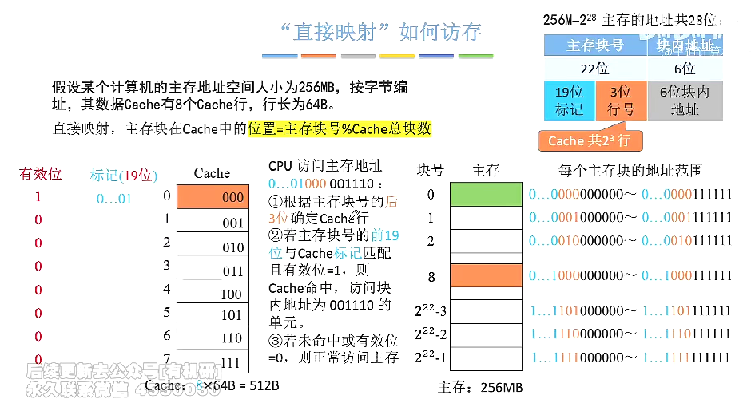

# Cache和主存的映射方式

1. ### 全相联映射（随便放）：

   任意一个主存块能够放到Cache的任意一个位置，每当Cache块中存入数据时，其对应的有效位会变为1。

   

   **CPU如何访问主存地址？**

   - 主存地址的**前22位**，对比Cache中所有块的标记；

   - 若**标记匹配**且**有效位 = 1**，则Cache**命中**，访问**块内地址**相同的单元；

   - 若**未命中**或者**有效位 = 0**，则**正常访问主存**。

     

2. ### 直接映射（只能放到固定的位置）：

   将**主存块号（22位）**进一步分为**标记块号（19位）**以及**行号（3位）**，其中标记块号用于指明主存块映射到Cache中具体哪一块，标记号与原来的主存块号功能一致。

   

   

3. ### 组相联映射（可以放到特定的分组）：

   以**2路组相联映射**为例（2块为一组，分四组），将**主存块号（22位）**分为**标记块号（20位）**与**组号（2位）**。

   

4. ### 三种不同映射之间的比较：

   

   

**考点：**给定一个主存地址，如何**拆分地址**，并**查找Cache并访存**？