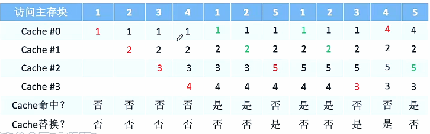
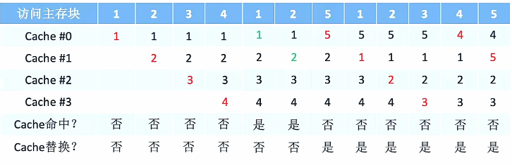
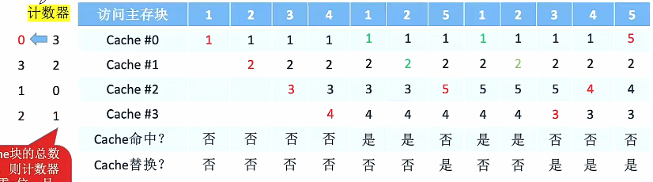
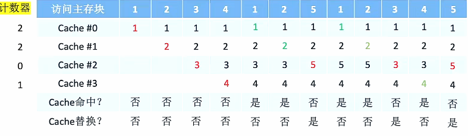

# Cache替换算法

1. ### 替换算法可以解决的问题：

   - **全相联映射：****Cache完全满了**才需要在**全局**选择替换哪一块；

   - **直接映射：**如果对应位置非空，则毫无选择地直接替换；

   - **组相联映射： ** **分组内满了才需要替换**，需要在**分组内**选择替换哪一块。

     

2. ### 随机算法RAND：

   若Cache已满，则随机选择一块替换。

   

   **总结：**实现简单，但是完全**没有考虑局部性原理**，命中率低，实际效果很不稳定。

   

3. ### 先进先出算法FIFO：

   若Cache已满，则替换最先被调入Cache的块。

    

   **总结：**实现简单，最开始按照#0 #1 #2 #3的顺序放入Cache，之后轮流替换#0 #1 #2 #3；然而，FIFO仍然**没有考虑局部性原理**，最先被调入Cache的块有可能也是访问最频繁的。

   

   **抖动现象：**频繁的换入换出。

   

4. ### 近期最少使用算法LRU(考试最常考）：

   为每个Cache块设置一个**“计数器”**，用于记录每个Cache块已经**多久没有被访问过了**。当Cache满后替换**“计数器”最大的一个**。

   - 命中时，所命中的行的计数器清零，比其低的计数器加1，其余不变；

   - 未命中时且还有空闲行时，新装入的行的计数器置0，其余的非空闲行全加1；

   - 未命中且无空闲行时，计数值最大的行的信息块被淘汰，新装行的计数器置为0，其余全加1。

     

     **Cache块的总数 = 2^n^，那么计数器只需要n位**，Cache装满后所有**计数器的值一定是不重复的**。

     

     **手算LRU技巧：**当遇到需要替换的时候，从当前访问的主存块往前一个一个找，找到离当前访问主存块最远被访问的Cache即可替换。

     **总结：**

     - LRU算法是基于**“局部性原理”**的，近期被访问过的主存块在不久的将来也很有可能被再次访问，因此淘汰最久没有被访问过的主存块是合理的，LRU算法的实际运行效果优秀，Cache命中率高；

     - 若被频繁访问的**主存块数量 > Cache行**的数量，则也有可能发生**抖动现象** {1,2,3,4,5,1,2,3,4,5,...}。

       

5. ### 最近不经常使用算法LFU：

   为每个Cache块设置一个**“计数器”**，用于**记录每个Cache块被访问过几次**。当Cache块满后替换**“计数器”最小的一个块**。

   

   **总结：**曾经经常被访问的主存块未来不一定会用到，因此并没有很好地遵循局部性原理，因此实际的运行效果不如LRU。