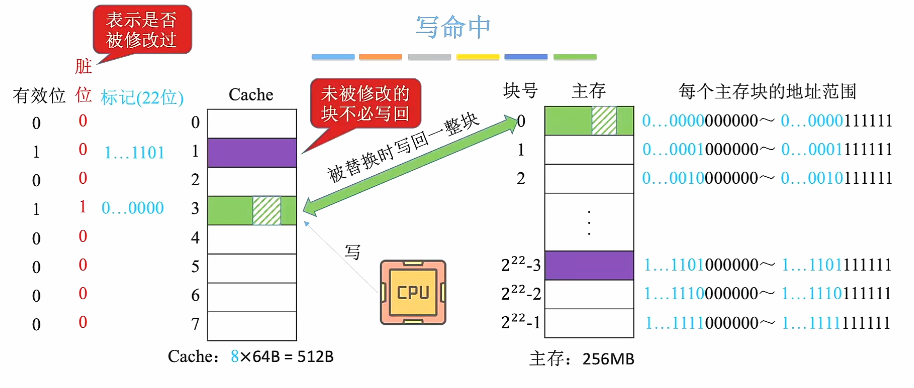
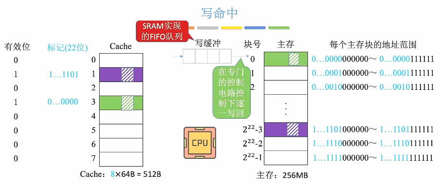
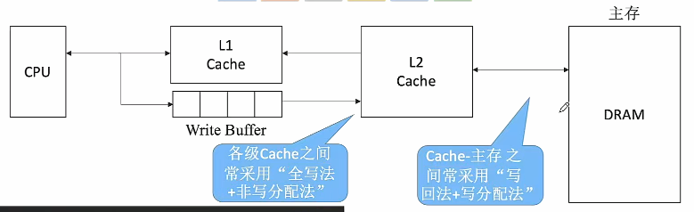

# Cache写策略

为什么不考虑读命中、读不命中问题？——因为进行读操作**并不会导致数据不一致问题**。

1. ### 写命中：

   - **写回法：**当CPU对Cache写命中时，只修改Cache的内容，而不立即写入主存，只有当这个块被换出时才写回主存。在Cache里面设置一个**“脏位”**，用于检测Cache的这个位置**是否被修改过**。

     

     减少了访存次数，但存在数据不一致的隐患。

     

   - **全写法（写直通法）：**当CPU对Cache写命中时，必须**把数据同时写入Cache和主存**，一般使用写缓冲（使用SRAM实现的FIFO队列）。

     

     因为使用写缓冲，CPU写的速度很快，若写操作不频繁，则效果很好；若写操作很频繁，可能会因为写缓冲饱和而发生阻塞（写缓冲的**容量有限**，当写缓冲满了就会阻塞）。

     

2. ### 写不命中：

   - **写分配法：**当CPU对Cache写不命中时，**把主存的块调入Cache，在Cache中修改**，通常**搭配写回法**使用。

   - **非写分配法：**当CPU对Cache写不命中时，**只写入内存，不调入Cache**，通常**搭配全写法使用**。

     

3. ### 多级Cache：

   离CPU越近的速度越快，容量越小；

   离CPU越远的速度越慢，容量越大。

   

   

   

